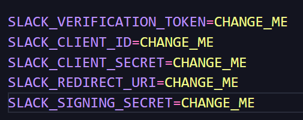
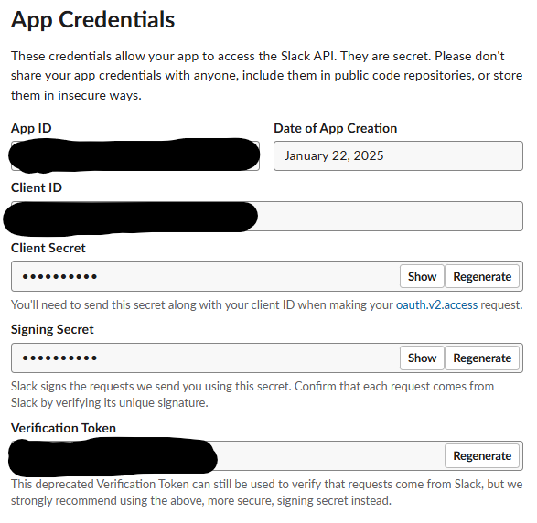

# About
The AI-Powered Slack Bot integrates [Hugging Face's](https://huggingface.co/) models into Slack, enabling AI-driven conversations within your workspace. Built with Python, it uses the Slack SDK and OpenAI's API to facilitate natural language interactions.

## Stack


## How to run
### Create an app
- at first you need to create and app with the slack [app manager](https://api.slack.com/slack-apps)
- with your app created, in 'Yours apps' session you will be able to get all theses env vars:





- to be able to install your app in any workspace you need to set an redirect url, in case of testing i just used `https://localhost:5000`, with this feature we can create an 'add to slack' button to distribute our app,  for more details  read [this](https://api.slack.com/authentication/oauth-v2)

IMPORTANT:
- Slack only accepts https protocol so you need to create ssl certificates and run in the flask [application](./backend/app.py)
- To handle event subscriptions you need to pass an url in order to enable slacks to making post requests for our app, so ive used [ngrok](https://ngrok.com/docs/) too create a temporary test domain, you only need to worry about running the flask app in https, generate a domain with ngrok, enable events, subscribe bot to the events that you need and voilá...app is not configured yet lol.


### AI
- Create on account in [Hugging Face](https://huggingface.co/) and generate an HF token to put in the env var.
- its a simple prompt that generate what do you want, u can change the default prompt in [llm_service.py](./backend/services/llm_service.py)

### Installing dependencies
```bash
python -m venv .venv
source .venv/bin/activate
pip install poetry
poetry install --no-root
```

### Running
- docker:
```bash
docker compose -f .\docker-compose.yml up -d --build  
```

- locally: remember setting up the FLASK_APP env var and [creating ssl certificates](https://www.youtube.com/watch?v=VqnSenJAheU) to run the app in https
```python
python backend/app.py
```
